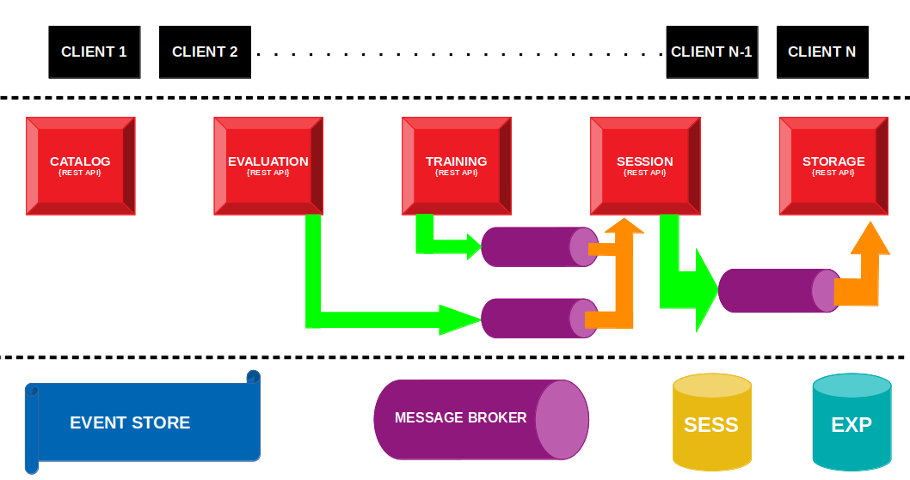
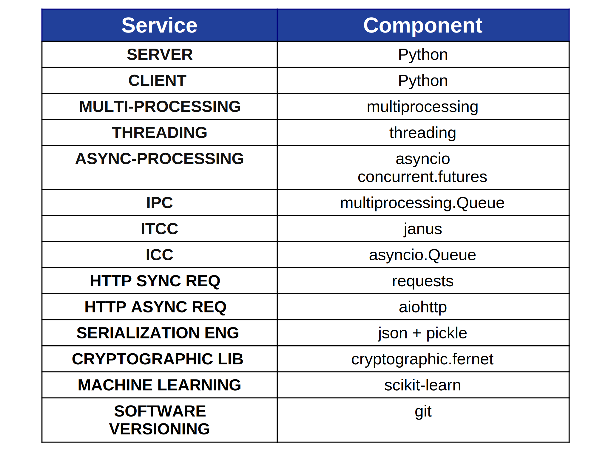

# AutoLearn

AutoLearn è un Applicativo Distribuito che permette la gestione del ciclo di vita di un Modello di
Machine Learning.

## BUSINESS-LOGIC

### *[ML-PIPELINE]*
>- Visualizza Modelli e Dataset presenti nel Catalogo                                   
>- Training impostando una serie di parametri:                                   
>    - Dataset
>    - Modello
>               
>
>- Calcolo Misure Valutazione Modello sul Test-Set dato il NUMERO_SESSIONE       
>            
>
>- Salvataggio Dati Sessione (Training e/o Evaluation) nello Storage Permanente dato il NUMERO_SESSIONE 

### *[DASHBOARD-PIPELINE]*
>- Visualizza Log Esperimenti di Sessione 
>- Visualizzazione Log Esperimenti Passati 

### *[ADMIN-PIPELINE]*
>- Visualizza Log Comportamentale di un Singolo Microservizio in ordine cronologico
>- Visualizza Log Comportamentale di tutto il Sistema in ordine cronologico

## PERSISTENZA
- Tutti i dati degli Esperimenti Passati saranno archiviati in una base di dati opportuna
        **ES TUPLA-ESPERIMENTO:** { {TIMESTAMP_COMMIT_SESSIONE} , DATI_ESPERIMENTI: {Addestr, Eval}}

- Tutti i dati di Sessione saranno archiviati in una base di dati opportuna
        **ES TUPLA-SESSIONE:**  { {TIMESTAMP_SESSION_BUILD} , DATI_ESPERIMENTI: {Addestr, Eval}}

- Tutti i log del Comportamento del Sistema saranno archiviati in una apposito Event Store:
        **ES-TUPLA EVENTO:**  { {ID_SOURCE_SERVICE , ID_DESTINATION_SERVICE , MESSAGE_TYPE , TIMESTAMP} , PAYLOAD}

    
## PRESENTAZIONE
- CLI scritta in Python
- Per eseguire le operazioni, il client invocherà ,spesso in maniera asincrona, le procedure remote messe a disposizione dal server attraverso una serie di API REST.

------------------------------------------------------------------------------------------
## REQUISITI PROGETTUALI

### *[MACHINE LEARNING]*
>- I dataset devono risiedere sul Backend
>- Modelli di ML disponibili a Catalogo:
>    - Regressore Logistico
>    - Decision Tree
>    - Random Forest
>    - SVM
>    - Naive Bayes
>
>- Metriche di Valutazione
>    - Accuracy
>    - Precision
>    - Recall

### *[ASPETTI ARCHITETTURALI]*
>- Il Backend sarà a Microservizi
>- Ogni Microservizio espone un REST End-Point
>- Le comunicazioni Sincrone avverranno attraverso chiamate ai REST End-Point
>- Le comunicazione Asincrone avverranno attraverso Message Broker
>- La Logica associata ad ogni chiamata REST verrà gestita da un apposito Processo, generato al momento della chiamata
>
>- Ogni Microservizio sarà costituito da 3 Tipologie di Processi Differenti:
>    - **REST-WORKER**, processo che resta in ascolto per chiamate al REST End-Point
>    - **EVENT-WORKER**, processo che resta in ascolto ,asincronicamente, in merito a nuovi eventi associati ad un task specifico
>    *(ES. Comunicazione asincrona fra Microservizi)*
>    - **TASK-WORKER**, processo che prende in carico il task associato alla chiamata di un’API REST
>
>- I Microservizi possono avere più istanze parallele in esecuzione, dato che il Web Server sfrutta il parallelismo
offerto dalle moderne CPU Multi-Core

### *[GESTIONE DELLA SESSIONE]*
>- Il sistema conserva dei dati di sessione che il Client può decidere di confermare in futuro.
>- La conferma di una Sessione implica la sua scrittura nello Storage permanente e la sua
successiva rimozione.
>- Essenzialmente, un record di sessione contiene i dati di Training e di Evaluation.
>- I dati di sessione verranno mantenuti su un apposito Database (DATABASE SESSION STATE).

### *[REQUISITI DI SICUREZZA]*
>- Client e Server utilizzano uno schema di Crittografia Simmetrico per scambiarsi Informazioni Confidenziali.
>- La chiave crittografica sarà una chiave a 128 bit generata dall'Algoritmo AES.
>- Le informazioni Confidenziali delle comunicazioni sono i Dati di Sessione.

### *[MONITORAGGIO]*
>- Lo stato passato dell’applicazione deve essere ricostruibile
>- Ogni Comunicazione fra Microservizi deve essere segnala ed archiviata
>- Ogni Comunicazione Client ------> Backend deve essere segnala ed archiviata
>- Tipologia Archiviazione:
>    - Memoria
>    - Event Store

### *[REQUISITI DI MODULARITÀ]*
>- La costruzione dell'applicativo rende *semplice* l'aggiunta di nuovi Modelli all'interno del Catalogo
>- La costruzione dell'applicativo rende *semplice* l'aggiunta di nuove Misure di Valutazione all'interno del Catalogo
    

------------------------------------------------------------------------------------------
## ARCHITETTURA DEL SOFTWARE

## DESIGN PATTERN
- Session State                                     
- Remote Proxy                                     
- Forward-Receiver                               
- Remote Facade
- Data Transfer Object
- Serialized LOB    
- Pipeline                                 
- Event Sourcing                                    

## STACK SOFTWARE - GENERALE

## STACK SOFTWARE - MICROSERVIZI

------------------------------------------------------------------------------------------
## REQUISITI CLIENT

Requisiti:

1. [Anaconda](https://www.anaconda.com/products/individual)
2. Python 3.7
3. Librerie Python da installare:

        pytest
        sphinx
        sphinx_rtd_theme
        rinohtype
        pdoc3
        aiohttp[speedups]
        requests
        typing
        dataclasses

Comandi Installazione Ambiente, Interprete e Librerie:

        conda env create -f $REPO_DIR/client_requirements/conda_client_env.yaml
        
        
## ISTRUZIONI PER ESEGUIRE IL PROGETTO
1. Installare *Docker* sul proprio sistema
2. Imposta le Variabili d'Ambiente modificando opportunamente il file *$HOME_REPO/docker/production_env/.env*
3. Avvia il backend:

        cd $REPO_DIR/docker/production_env
    
        ./build_img.sh
    
        docker-compose up -d

4. Da un browser interno alla network dei Container, accedere al *Kafka Control Center* (*localhost:PORTA__OUT_TO_IN__CONTAINER*) e creare i seguenti Topic:
    - **Catalog** 
        - *N Partizioni* = 1
    - **Training**
        - *N Partizioni* = 1
    - **Evaluation**
        - *N Partizioni* = 1
    - **Session**
        - *N Partizioni* = 1
    - **Storage**
        - *N Partizioni* = 1

5. Avvia il frontend: 

        cd $CLIENT_APP_DIR

        conda activate autolearn_client_env

        python3 autolearn_client.py

## ISTRUZIONI PER AVVIARE LA CONSOLE DI AMMINISTRAZIONE DEL SISTEMA
1. A Sistema Avviato, aprire una shell da un Host *interno* alla Network dei Container
2. Eseguire il seguente comando:

        docker attach admin

## DEMO

------------------------------------------------------------------------------------------
## STRATEGIA DI BRANCHING
- **MAIN**, codice di produzione.
- **DEVELOP**, codice di sviluppo.

## STRUTTURA DEL REPOSITORY
- **code**, contiene il codice del progetto.
    - **0.legacy**, contiene componenti *Software Deprecati* che restano significativi.
    - **classes**, contiene le classi del progetto.
    - **modules**, contiene i moduli (insieme di funzioni) del progetto.
    - **packages**, contiene le architetture (serie di classi correlate) del progetto.
    - **solutions**, contiene il Software di Produzione del progetto.
- **demo**, contiene immagini demo del Software in esecuzione.
- **docker**, contiene le immagini docker utilizzate come ambiente di sviluppo/produzione.
- **img**, contiene le immagini usate nei vari file markdown del repository.
- **report**, contiene la relazione del progetto.
- **talk**, contiene un blocco di slide che illustra le caratteristiche salienti del progetto.

------------------------------------------------------------------------------------------
## AUTORE
- [@r-scalia](https://github.com/rscdev7) Rosario Scalia

## RINGRAZIAMENTI 
- [@e-tramontana](https://www.dmi.unict.it/tramonta/) Prof Emiliano Alessio Tramontana (UniCT)
- [@a-fornaia](https://www.dmi.unict.it/fornaia/) Prof Andrea Francesco Fornaia (UniCT)    
